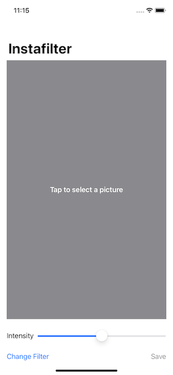
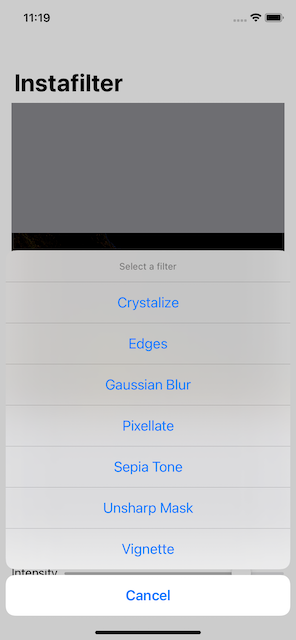
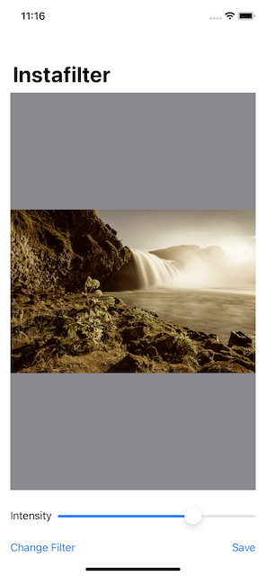
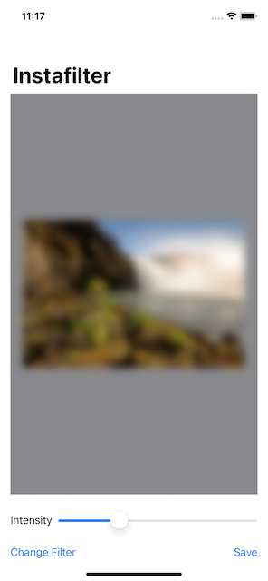
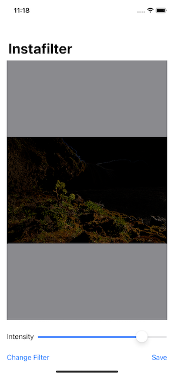
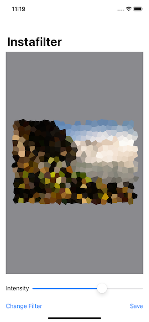

#  Instafilter

This project is an app used to manipulate images applying some filters

I made this project to improve my knowledge in iOS development, specially SwiftUI.

I learned how to:

- Integrate **Core Image** with SwiftUI
- Show multiple options with ActionSheet
- Wrap a UIViewController in a SwiftUI view
- Use coordinators to manage SwiftUI view controllers
- Basic image filtering using Core Image
- Customize filter using ActionSheet
- Save images to the user’s photo library

## Examples

| Home  | Filters  |
| --- | --- |
|    |  |
| Sepia   | Gaussian Blur  |
|    |  |
| Edges  | Crystalize  |
|    |  |

This app was made using the course **100 Days of SwiftUI** from [Hacking With Swift](https://www.hackingwithswift.com/100/swiftui/)
